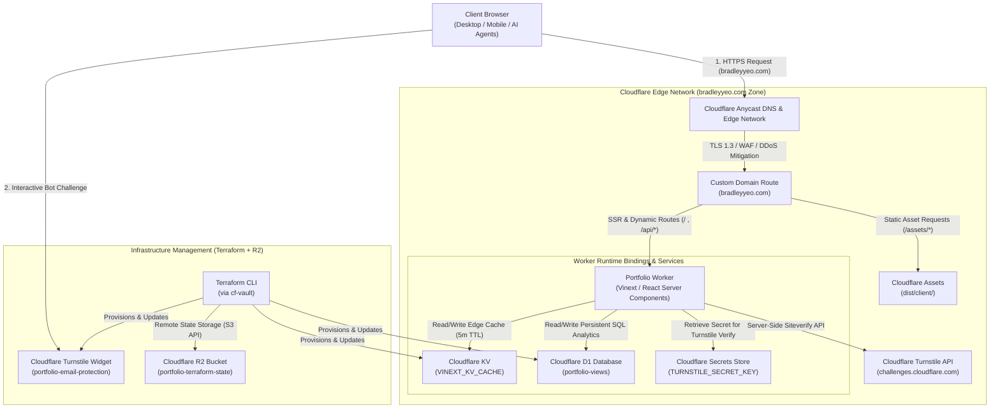

# Terraform Remote State Storage

- Create user API token
- Install cf-vault

## Permission Scope

Account Scope (All accounts or Account: 346e5692ae2024c494ef5f58c36fae37)
Account → Workers Scripts → Edit
Account → Workers KV Storage → Edit
Account → D1 → Edit
Account → Turnstile → Edit
Account → Workers R2 Storage → Edit
Zone Scope (All zones or Zone: bradleyyeo.com)
Zone → Zone WAF → Edit
Zone → Zone Settings → Edit
Zone → Zone → Read
Zone → Workers Routes → Edit
User Scope
User → User Details → Read

## Backend Credentials

Set environment variables for R2 S3-compatible backend authentication:

```bash
export AWS_ACCESS_KEY_ID="<new Access Key ID>"
export AWS_SECRET_ACCESS_KEY="<new Secret Access Key>"
```

---

# Cloudflare Developer Platform Architecture (bradleyyeo.com)

The portfolio application is hosted entirely on the Cloudflare Developer Platform, serving the custom domain `bradleyyeo.com` globally via Cloudflare's Anycast edge network with zero dedicated origin servers.

---

# Architecture Diagram & System Flow



## System Data Flow & Lifecycle

### Edge Routing & Custom Domain Resolution
- Requests for `bradleyyeo.com` enter the Cloudflare Anycast network across 200+ edge locations.
- Cloudflare terminates TLS 1.3 at the edge and enforces zone-level security policies.
- The Custom Domain route mapping in `wrangler.jsonc` directly binds `bradleyyeo.com` to the `portfolio` Worker script without reverse proxy overhead.

### Static Asset Delivery
- Asset requests (`/_next/static/*`, CSS, client-side JS bundles, images, icons) are routed directly to Cloudflare Assets (`dist/client/`).
- Assets are served with optimal cache headers from edge storage.

### Server-Side Rendering (Vinext + React Server Components)
- Navigation requests execute the Vinext fetch handler (`vinext/server/fetch-handler`) inside a V8 isolate.
- React Server Components render the HTML layout and initial page content with zero cold-start latency.

### Multi-Tier View Analytics (KV Cache + D1 SQL)
- `GET /api/views`: Reads view counts from Cloudflare KV (`VINEXT_KV_CACHE`) for low-latency response. If absent from cache, queries Cloudflare D1 (`portfolio-views`) and repopulates KV with a 5-minute TTL.
- `POST /api/views`: Evaluates incoming User-Agent headers against known automated agent and crawler signatures to classify visitors as `human` or `agent`, increments the record in D1, and refreshes KV cache.

### Turnstile Bot Mitigation & Email Protection
- Client component renders the Cloudflare Turnstile widget configured for `bradleyyeo.com` and `localhost`.
- Upon successful client challenge, a signed verification token is dispatched to `POST /api/verify-turnstile`.
- The Worker fetches the `TURNSTILE_SECRET_KEY` from the Cloudflare Secrets Store binding.
- The Worker validates the token against `challenges.cloudflare.com/turnstile/v0/siteverify`, checking action name (`view_email`) and hostname (`bradleyyeo.com`).
- Upon successful verification, the verified human visit counter in D1 is updated and the protected email is unlocked.

### Infrastructure as Code & State Isolation
- Cloudflare resources (KV namespaces, D1 databases, Turnstile widgets) are declaratively provisioned with Terraform using the `cloudflare/cloudflare` v5.x provider.
- Terraform state is preserved in an S3-compatible Cloudflare R2 bucket (`portfolio-terraform-state`).
- Access tokens and credentials are encrypted and isolated via `cf-vault`.

---

# Terraform Project Structure & Configuration

Cloudflare infrastructure and state storage are managed via Terraform (`cloudflare/cloudflare` provider v5.x and `hashicorp/local` provider).

## Directory Structure

```
terraform/
├── terraform.tf          # Provider requirements and S3/R2 remote state backend
├── variables.tf          # Input variable declarations (account_id)
├── terraform.tfvars      # Local variable values (account_id)
├── portfolio.tf          # Core infrastructure resources (KV, D1 Database, Turnstile)
├── outputs.tf            # Exported resource IDs and credentials for application bindings
├── zone.tf               # Zone settings and WAF ruleset configuration
├── terraform.tfstate     # Local state file (when local backend is used)
└── .terraform.lock.hcl   # Provider dependency lockfile
```

## File Breakdown

### Provider & Remote Backend Configuration (`terraform/terraform.tf`)

Defines the required providers and the S3-compatible backend pointing to Cloudflare R2.

```hcl
terraform {
  required_version = ">= 1.3.0"
  required_providers {
    cloudflare = {
      source  = "cloudflare/cloudflare"
      version = "~> 5.23.0"
    }
    local = {
      source  = "hashicorp/local"
      version = "~> 2.5"
    }
  }

  backend "s3" {
    bucket    = "portfolio-terraform-state"
    key       = "terraform/terraform.tfstate"
    endpoints = { s3 = "https://<ACCOUNT_ID>.r2.cloudflarestorage.com" }
    region    = "apac"

    skip_credentials_validation = true
    skip_region_validation      = true
    skip_requesting_account_id  = true
    skip_metadata_api_check     = true
    skip_s3_checksum            = true
  }
}

resource "cloudflare_r2_bucket" "portfolio_tfs" {
  account_id    = var.account_id
  name          = "portfolio-terraform-state"
  location      = "apac"
  storage_class = "Standard"
}
```

### Input Variables (`terraform/variables.tf`)

```hcl
variable "account_id" {
  type        = string
  description = "Cloudflare Account ID"
}
```

### Portfolio Resources (`terraform/portfolio.tf`)

Provisions the KV namespace, D1 SQL database, and Turnstile challenge widget.

```hcl
# KV namespace for Vinext server-side data cache
resource "cloudflare_workers_kv_namespace" "vinext_kv_cache" {
  account_id = var.account_id
  title      = "VINEXT_KV_CACHE"
}

# D1 database for persistent page view counters
resource "cloudflare_d1_database" "portfolio_views" {
  account_id = var.account_id
  name       = "portfolio-views"

  read_replication = {
    mode = "disabled"
  }
}

# Cloudflare Turnstile widget for email protection
resource "cloudflare_turnstile_widget" "portfolio_email_turnstile" {
  account_id = var.account_id
  name       = "portfolio-email-protection"
  domains    = ["bradleyyeo.com", "localhost"]
  mode       = "managed"
}
```

### Infrastructure Outputs (`terraform/outputs.tf`)

Exposes IDs and keys necessary for configuring application runtime bindings and secrets.

```hcl
output "kv_namespace_id" {
  description = "VINEXT_KV_CACHE namespace ID"
  value       = cloudflare_workers_kv_namespace.vinext_kv_cache.id
}

output "d1_database_id" {
  description = "Portfolio views D1 database ID"
  value       = cloudflare_d1_database.portfolio_views.id
}

output "turnstile_site_key" {
  description = "Cloudflare Turnstile site key (public)"
  value       = cloudflare_turnstile_widget.portfolio_email_turnstile.id
}

output "turnstile_secret_key" {
  description = "Cloudflare Turnstile secret key (private)"
  value       = cloudflare_turnstile_widget.portfolio_email_turnstile.secret
  sensitive   = true
}
```

### Zone & Edge Security Configuration (`terraform/zone.tf`)

Configures SSL/TLS policies, security level, and HTTP request firewall rules.

```hcl
# Zone settings template
# resource "cloudflare_zone_setting" "free" {
#   for_each = {
#     ssl                      = "strict"
#     always_use_https         = "on"
#     automatic_https_rewrites = "on"
#     brotli                   = "on"
#     security_level           = "high"
#     browser_check            = "on"
#     tls_1_3                  = "on"
#     opportunistic_encryption = "on"
#     min_tls_version          = "1.3"
#   }
#   zone_id    = var.zone_id
#   setting_id = each.key
#   value      = each.value
# }

# resource "cloudflare_ruleset" "free_waf_rules" {
#   zone_id     = var.zone_id
#   name        = "Free Tier WAF and API Protection Rules"
#   description = "Rate limiting and bot mitigation rules for API endpoints"
#   kind        = "zone"
#   phase       = "http_request_firewall_custom"
# }
```

## Application Integration & Bindings (`portfolio/wrangler.jsonc`)

Terraform outputs map directly into the Worker runtime bindings:

```jsonc
{
  "$schema": "node_modules/wrangler/config-schema.json",
  "name": "portfolio",
  "compatibility_date": "2026-08-11",
  "compatibility_flags": ["nodejs_compat"],
  "main": "vinext/server/fetch-handler",
  "assets": {
    "directory": "dist/client",
    "not_found_handling": "none",
    "binding": "ASSETS"
  },
  "cache": {
    "enabled": true
  },
  "kv_namespaces": [
    {
      "binding": "VINEXT_KV_CACHE",
      "id": "2f6441c9b2ce488197447b3fab33a90f" // From output "kv_namespace_id"
    }
  ],
  "d1_databases": [
    {
      "binding": "VIEWS_DB",
      "database_id": "6b074eae-5bb3-4d88-ba22-282c482b96b1", // From output "d1_database_id"
      "database_name": "portfolio-views"
    }
  ],
  "secrets_store_secrets": [
    {
      "binding": "TURNSTILE_SECRET_KEY",
      "secret_name": "turnstile-secret-key",
      "store_id": "1cf115b4569f48c088f6780aa2f6a466" // Cloudflare Secrets Store
    }
  ],
  "routes": [
    {
      "pattern": "bradleyyeo.com",
      "custom_domain": true
    }
  ]
}
```

---

# TypeScript & React Implementation (`portfolio/`)

## Cloudflare Turnstile Email Protection (`src/components/EmailProtection.tsx`)

```tsx
"use client";

import { useState, useEffect, useRef } from "react";
import Script from "next/script";

interface EmailProtectionProps {
  email: string;
}

const DEFAULT_SITE_KEY =
  process.env.NEXT_PUBLIC_TURNSTILE_SITE_KEY || "1x00000000000000000000AA";

export function EmailProtection({ email }: EmailProtectionProps) {
  const [isVerified, setIsVerified] = useState(false);
  const [showChallenge, setShowChallenge] = useState(false);
  const [scriptLoaded, setScriptLoaded] = useState(false);
  const containerRef = useRef<HTMLDivElement>(null);
  const widgetIdRef = useRef<string | null>(null);

  useEffect(() => {
    if (showChallenge && scriptLoaded && containerRef.current && window.turnstile) {
      if (!widgetIdRef.current) {
        widgetIdRef.current = window.turnstile.render(containerRef.current, {
          sitekey: DEFAULT_SITE_KEY,
          callback: () => {
            setIsVerified(true);
            setShowChallenge(false);
          },
          theme: "auto",
        });
      }
    }
  }, [showChallenge, scriptLoaded]);

  if (isVerified) {
    return (
      <a
        href={`mailto:${email}`}
        className="inline-flex items-center gap-2 rounded-xl bg-accent px-5 py-2.5 text-sm font-semibold text-white"
      >
        {email}
      </a>
    );
  }

  return (
    <div className="flex flex-col items-start gap-3">
      <Script
        src="https://challenges.cloudflare.com/turnstile/v0/api.js?render=explicit"
        onLoad={() => setScriptLoaded(true)}
      />
      {!showChallenge ? (
        <button
          onClick={() => setShowChallenge(true)}
          className="rounded-xl border border-accent/40 px-4 py-2 text-sm font-semibold text-accent"
        >
          Verify with Cloudflare Turnstile to View Email
        </button>
      ) : (
        <div ref={containerRef} className="min-h-[65px]" />
      )}
    </div>
  );
}
```

## Bilingual Resume Data (`src/data/resume.ts`)

```typescript
export const resumeData = {
  en: {
    name: "Bradley Yeo Kian",
    email: "yeo.bradley@gmail.com",
    tagline: "AI Infrastructure & DevSecOps Engineer",
    about: "Infrastructure engineer specialising in large-scale GPU clusters...",
    skills: { ... },
    experience: { ... },
    certifications: { ... },
    education: { ... },
  },
  zh: {
    name: "杨建",
    email: "yeo.bradley@gmail.com",
    tagline: "人工智能基础设施与开发安全运维工程师",
    about: "专注于大规模GPU集群、气隙隔离Kubernetes部署...",
    skills: { ... },
    experience: { ... },
    certifications: { ... },
    education: { ... },
  },
} as const;

export type Language = "en" | "zh";
```

---

# Verification and Build Workflow

- Step: Build Portfolio using Vinext
  ```bash
  cd portfolio
  npm run build:vinext
  ```
- Step: Initialize & Apply Infrastructure with R2 Backend
  ```bash
  cd terraform
  export AWS_ACCESS_KEY_ID="<R2_ACCESS_KEY_ID>"
  export AWS_SECRET_ACCESS_KEY="<R2_SECRET_ACCESS_KEY>"
  cf-vault exec tf-port -- terraform init -reconfigure
  cf-vault exec tf-port -- terraform apply
  ```
- Step: Deploy Worker to Cloudflare
  ```bash
  cd portfolio
  cf-vault exec tf-port -- npm run deploy:vinext
  ```

---

# Portfolio Deployment (Vinext + Cloudflare Workers)

The `portfolio/` directory contains a personal portfolio site built with Vinext (Vite-powered Next.js API-compatible framework) targeting Cloudflare Workers. All required Cloudflare resources are provisioned via Terraform in the `terraform/` directory.

## Prerequisites

- `cf-vault` configured with your profile (`tf-port` / `bradley-admin`) containing `CLOUDFLARE_API_TOKEN` and `CLOUDFLARE_ACCOUNT_ID`
- Node.js ≥ 18 and npm installed
- Terraform ≥ 1.3.0 installed

## Authentication

All commands that talk to Cloudflare must be wrapped with `cf-vault exec <profile> --`:

```bash
cf-vault exec tf-port
```

Or prefix individual commands inline:

```bash
cf-vault exec tf-port -- <command>
```

## Provision Cloudflare Resources (Terraform)

Provisions the KV namespace (`VINEXT_KV_CACHE`), D1 Database (`portfolio-views`), and Turnstile widget (`portfolio-email-protection`).

```bash
cd terraform

# Initialise providers and backend
cf-vault exec tf-port -- terraform init

# Provision infrastructure
cf-vault exec tf-port -- terraform apply -var="account_id=$CLOUDFLARE_ACCOUNT_ID"
```

## Build the Portfolio

```bash
cd portfolio
npm run build:vinext
```

Build outputs:
- `dist/client/` — static assets served via Cloudflare Assets
- `dist/server/index.js` — the Worker bundle

## Deploy to Cloudflare Workers

```bash
cd portfolio
cf-vault exec tf-port -- npm run deploy:vinext
```

The Worker is available at `https://portfolio.<your-subdomain>.workers.dev` and `https://bradleyyeo.com`.

## Verify Deployment

```bash
curl -I https://bradleyyeo.com
# Expect: HTTP/2 200
```

---

# Local Development

Run the Vinext dev server (Vite-powered, fast HMR):

```bash
cd portfolio
npm run dev:vinext   # port 3001 — uses Vite + vinext
```

Or run the original Next.js dev server:

```bash
cd portfolio
npm run dev          # port 3000 — standard Next.js
```

---

# Cloudflare Resources Summary (Free Tier)

| Resource | Name / Identifier | Details / Free Tier Allowance |
|---|---|---|
| Workers KV Namespace | `VINEXT_KV_CACHE` | Server-side data cache (1GB storage, 100k reads/day) |
| D1 SQL Database | `portfolio-views` | Persistent view counters (5GB storage, 5M reads/day) |
| Turnstile Widget | `portfolio-email-protection` | Managed bot protection for email reveal (Unlimited challenges) |
| R2 Storage Bucket | `portfolio-terraform-state` | S3-compatible remote Terraform state backend (10GB storage) |
| Worker Service | `portfolio` | Vinext SSR + React Server Components (100k requests/day) |

---

# Destroy Infrastructure

```bash
cd terraform
cf-vault exec tf-port -- terraform destroy -var="account_id=$CLOUDFLARE_ACCOUNT_ID"
```

# Free Tier Security & Resource Protection Strategy

Protecting a serverless architecture on Cloudflare's Free Tier focuses on two vectors: **threat mitigation** (DDoS, scrapers, abusive bots) and **quota defense** (preventing runaway traffic from exhausting daily free limits: 100k Worker requests/day, 100k D1 writes/day, 100k KV reads/day).

---

# Edge & Zone Protections (WAF & TLS)

## Zone-Level Hardening

Configure strict edge transport and verification settings on the `bradleyyeo.com` zone:

- **Strict SSL/TLS**: Enforce end-to-end encryption with `ssl = "strict"` and `min_tls_version = "1.3"`.
- **Automatic HTTPS Rewrites & Always Use HTTPS**: Terminate unencrypted HTTP traffic at Cloudflare's Anycast edge before it reaches Worker compute.
- **Browser Integrity Check**: Drop requests with malformed headers or known abusive crawler user-agents before Worker execution.

## Free Tier Rate Limiting (WAF Rule)

Cloudflare Free plan includes **1 free Rate Limiting Rule** and **5 free custom WAF rules**. Apply rate limiting to all `/api/*` routes to protect D1 write quotas:

- **Target Paths**: `/api/views`, `/api/verify-turnstile`
- **Threshold**: 30 requests per minute per client IP.
- **Action**: Return HTTP 429 (or Managed Challenge) at the edge, zero Worker CPU consumption.

## Bot Fight Mode

- Enable **Bot Fight Mode** in the Cloudflare Dashboard under **Security → Bots**.
- Automatically challenges or blocks malicious scrapers and automated vulnerability scanners at the edge without requiring custom code.

---

# Worker Runtime & Quota Defense

## Edge HTTP Caching on Read Endpoints

Prevent every page view from hitting KV or D1 by leveraging Cloudflare's edge cache for `GET /api/views`:

- Return a `Cache-Control` header on `GET /api/views`:
  ```typescript
  return NextResponse.json(counts, {
    headers: {
      "Cache-Control": "public, max-age=10, s-maxage=60, stale-while-revalidate=30",
    },
  });
  ```
- Cloudflare Anycast edge PoPs serve identical read requests from edge cache, reducing KV reads from $O(N)$ requests to $O(1)$ per edge location per minute.

## Payload Size & Method Guards

Add fast early returns in API route handlers before parsing JSON:

- **Method Verification**: Reject unsupported HTTP verbs immediately (`PUT`, `DELETE`, `PATCH`).
- **Content-Length Capping**: In [`portfolio/src/app/api/verify-turnstile/route.ts`](file:///Users/bradleyyeo/Documents/learn/cf-fundametals/portfolio/src/app/api/verify-turnstile/route.ts#L76-L86), reject request bodies exceeding 2KB to prevent memory exhaustion attacks.

## D1 Write Throttling

- In `POST /api/views`, update D1 only after validating the User-Agent and verify the request is not a rapid-fire duplicate from the same IP session.
- Keep the D1 write operation lightweight using parameterized queries (e.g. `INSERT ... ON CONFLICT DO UPDATE`) to prevent SQL injection and connection locking.

---

# Storage & Credential Hardening

## R2 State Bucket Isolation

- **Disable Public Access**: Ensure both **Public Development URL** and **R2 Data Catalog** remain `Disabled` (as confirmed in your dashboard).
- **Least Privilege Tokens**: Scope the R2 S3 API token strictly to `portfolio-terraform-state` with `Object Read & Write` only (no bucket deletion permissions).

## Secrets Store Isolation

- Keep private credentials (`TURNSTILE_SECRET_KEY`) managed through **Cloudflare Secrets Store** or encrypted Worker secrets rather than committing `.env` files.

---

# Declarative Terraform Implementation (`terraform/zone.tf`)

You can automate the zone security settings directly in [`terraform/zone.tf`](file:///Users/bradleyyeo/Documents/learn/cf-fundametals/terraform/zone.tf):

```hcl
variable "zone_id" {
  type        = string
  description = "Cloudflare Zone ID for bradleyyeo.com"
  default     = "d46b41c2aaafe1ddc13b155bc8294ca7"
}

# 1. Zone Edge Security Settings
resource "cloudflare_zone_setting" "security" {
  for_each = {
    ssl                      = "strict"
    always_use_https         = "on"
    automatic_https_rewrites = "on"
    brotli                   = "on"
    security_level           = "medium"
    browser_check            = "on"
    min_tls_version          = "1.3"
  }
  zone_id    = var.zone_id
  setting_id = each.key
  value      = each.value
}

# 2. Free Tier API Rate Limiting (Protects D1 & Turnstile)
resource "cloudflare_ruleset" "api_rate_limiting" {
  zone_id     = var.zone_id
  name        = "Rate Limit API Routes"
  description = "Protect D1 writes and Turnstile verification from automated abuse"
  kind        = "zone"
  phase       = "http_ratelimit"

  rules = [
    {
      action = "block"
      ratelimit = {
        characteristics     = ["cf.colo.id", "ip.src"]
        period              = 60
        requests_per_period = 30
      }
      expression  = "(http.request.uri.path starts_with \"/api/\")"
      description = "Rate limit /api/* routes to max 30 requests per minute per IP"
      enabled     = true
    }
  ]
}
```