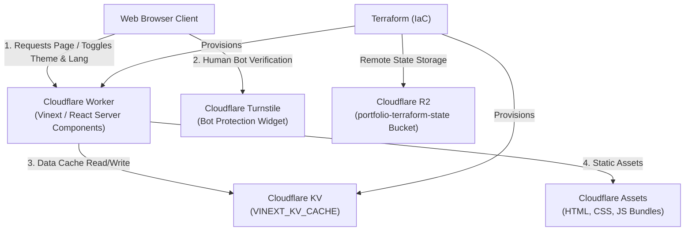

# Sequential Learning Order

- **Step 1:** [[DevOps/Cloudflare/01_Cloudflare_Core_Networking_and_Edge_Security|01 - Cloudflare Core Networking & Edge Security]]
- **Step 2:** [[DevOps/Cloudflare/02_Cloudflare_Caching_and_Edge_Performance|02 - Cloudflare Caching & Edge Performance]]
- **Step 3:** [[DevOps/Cloudflare/03_Cloudflare_Workers_Architecture_and_Primitives|03 - Cloudflare Workers Architecture & Primitives]]
- **Step 4:** [[DevOps/Cloudflare/04_Cloudflare_Developer_Platform_Master_Guide|04 - Cloudflare Developer Platform Master Guide]] *(You are here)*
- **Step 5:** [[DevOps/Cloudflare/05_Cloudflare_AI_Production_Scale_Guide|05 - Running AI Workloads on Cloudflare at Production Scale]]

---
# TF State
- Create user API token
Set
```
export AWS_ACCESS_KEY_ID="<new Access Key ID>"
export AWS_SECRET_ACCESS_KEY="<new Secret Access Key>"
```

# Cloudflare Developer Platform Fundamentals & Architecture

Cloudflare's Developer Platform provides serverless compute, storage, messaging, and AI capabilities executed globally across Cloudflare's Anycast network edge (200+ cities).

# Architecture Diagram & Portfolio System Flow

The portfolio application is built with **Next.js (App Router)** and **Vinext** (Vite-powered Next.js API-compatible framework for Cloudflare Workers), leveraging Cloudflare Developer Platform services:



## System Data Flow

- **Page Rendering (Vinext + React Server Components):**
  - Requests hit the **Cloudflare Worker** running Vinext (`dist/server/index.js`).
  - Static assets (CSS, client JS) are served from **Cloudflare Assets** (`dist/client/`).
- **Server Data Caching:**
  - Vinext uses **Cloudflare KV** (`VINEXT_KV_CACHE`) for fast, globally distributed server-side data caching.
- **Email Protection (Cloudflare Turnstile):**
  - The client loads the Turnstile verification widget.
  - Upon human verification (`onSuccess`), the user's email address is dynamically revealed.
- **Infrastructure State Management:**
  - Terraform state is stored remotely in an **S3-compatible Cloudflare R2 bucket** (`portfolio-terraform-state`).

---

# Provisioning Cloudflare Portfolio Services with Terraform

Cloudflare infrastructure and state storage are managed via Terraform (`cloudflare/cloudflare` provider v5.x and `hashicorp/local` provider).

## Terraform Configuration (`terraform/`)

### 1. Provider & R2 Remote Backend (`terraform/terraform.tf`)

```hcl
terraform {
  required_version = ">= 1.3.0"
  required_providers {
    cloudflare = {
      source  = "cloudflare/cloudflare"
      version = "~> 5.23.0"
    }
    local = {
      source  = "hashicorp/local"
      version = "~> 2.5"
    }
  }

  backend "s3" {
    bucket    = "portfolio-terraform-state"
    key       = "terraform/terraform.tfstate"
    endpoints = { s3 = "https://<ACCOUNT_ID>.r2.cloudflarestorage.com" }
    region    = "apac"

    skip_credentials_validation = true
    skip_region_validation      = true
    skip_requesting_account_id  = true
    skip_metadata_api_check     = true
    skip_s3_checksum            = true
  }
}

resource "cloudflare_r2_bucket" "portfolio_tfs" {
  account_id    = var.account_id
  name          = "portfolio-terraform-state"
  location      = "apac"
  storage_class = "Standard"
}
```

### 2. Portfolio Worker & KV Resources (`terraform/portfolio.tf`)

```hcl
# KV namespace for Vinext server-side data cache
resource "cloudflare_workers_kv_namespace" "vinext_kv_cache" {
  account_id = var.account_id
  title      = "VINEXT_KV_CACHE"
}

# Portfolio Worker
resource "cloudflare_worker_script" "portfolio" {
  account_id = var.account_id
  name       = "portfolio"
  content    = file("../portfolio/dist/server/index.js")

  kv_namespace_binding {
    name         = "VINEXT_KV_CACHE"
    namespace_id = cloudflare_workers_kv_namespace.vinext_kv_cache.id
  }
}

# Auto-patch wrangler.jsonc with live KV namespace ID
resource "local_file" "wrangler_jsonc" {
  content = jsonencode({
    "$schema"           = "node_modules/wrangler/config-schema.json"
    name                = "portfolio"
    compatibility_date  = "2026-08-11"
    compatibility_flags = ["nodejs_compat"]
    main                = "vinext/server/fetch-handler"
    assets = {
      directory          = "dist/client"
      not_found_handling = "none"
      binding            = "ASSETS"
    }
    cache = { enabled = true }
    kv_namespaces = [
      {
        binding = "VINEXT_KV_CACHE"
        id      = cloudflare_workers_kv_namespace.vinext_kv_cache.id
      }
    ]
  })
  filename = "${path.module}/../portfolio/wrangler.jsonc"
}
```

---

# TypeScript & React Implementation (`portfolio/`)

## 1. Cloudflare Turnstile Email Protection (`src/components/EmailProtection.tsx`)

```tsx
"use client";

import { useState, useEffect, useRef } from "react";
import Script from "next/script";

interface EmailProtectionProps {
  email: string;
}

const DEFAULT_SITE_KEY =
  process.env.NEXT_PUBLIC_TURNSTILE_SITE_KEY || "1x00000000000000000000AA";

export function EmailProtection({ email }: EmailProtectionProps) {
  const [isVerified, setIsVerified] = useState(false);
  const [showChallenge, setShowChallenge] = useState(false);
  const [scriptLoaded, setScriptLoaded] = useState(false);
  const containerRef = useRef<HTMLDivElement>(null);
  const widgetIdRef = useRef<string | null>(null);

  useEffect(() => {
    if (showChallenge && scriptLoaded && containerRef.current && window.turnstile) {
      if (!widgetIdRef.current) {
        widgetIdRef.current = window.turnstile.render(containerRef.current, {
          sitekey: DEFAULT_SITE_KEY,
          callback: () => {
            setIsVerified(true);
            setShowChallenge(false);
          },
          theme: "auto",
        });
      }
    }
  }, [showChallenge, scriptLoaded]);

  if (isVerified) {
    return (
      <a
        href={`mailto:${email}`}
        className="inline-flex items-center gap-2 rounded-xl bg-accent px-5 py-2.5 text-sm font-semibold text-white"
      >
        {email}
      </a>
    );
  }

  return (
    <div className="flex flex-col items-start gap-3">
      <Script
        src="https://challenges.cloudflare.com/turnstile/v0/api.js?render=explicit"
        onLoad={() => setScriptLoaded(true)}
      />
      {!showChallenge ? (
        <button
          onClick={() => setShowChallenge(true)}
          className="rounded-xl border border-accent/40 px-4 py-2 text-sm font-semibold text-accent"
        >
          Verify with Cloudflare Turnstile to View Email
        </button>
      ) : (
        <div ref={containerRef} className="min-h-[65px]" />
      )}
    </div>
  );
}
```

## 2. Bilingual Resume Data (`src/data/resume.ts`)

```typescript
export const resumeData = {
  en: {
    name: "Bradley Yeo Kian",
    email: "yeo.bradley@gmail.com",
    tagline: "AI Infrastructure & DevSecOps Engineer",
    about: "Infrastructure engineer specialising in large-scale GPU clusters...",
    skills: { ... },
    experience: { ... },
    certifications: { ... },
    education: { ... },
  },
  zh: {
    name: "杨键",
    email: "yeo.bradley@gmail.com",
    tagline: "人工智能基础设施与开发安全运维工程师",
    about: "专注于大规模GPU集群、气隙隔离Kubernetes部署...",
    skills: { ... },
    experience: { ... },
    certifications: { ... },
    education: { ... },
  },
} as const;

export type Language = "en" | "zh";
```

---

# Verification and Build Workflow

- **Step 1: Build Portfolio using Vinext**
  ```bash
  cd portfolio
  npm run build:vinext
  ```
- **Step 2: Initialize & Apply Infrastructure with R2 Backend**
  ```bash
  cd terraform
  export AWS_ACCESS_KEY_ID="<R2_ACCESS_KEY_ID>"
  export AWS_SECRET_ACCESS_KEY="<R2_SECRET_ACCESS_KEY>"
  cf-vault exec bradley-admin -- terraform init -reconfigure
  cf-vault exec bradley-admin -- terraform apply
  ```
- **Step 3: Deploy Worker to Cloudflare**
  ```bash
  cd portfolio
  cf-vault exec bradley-admin -- npm run deploy:vinext
  ```

---

# Portfolio Deployment (Vinext + Cloudflare Workers)

The `portfolio/` directory contains a personal portfolio site built with Vinext (Vite-powered Next.js API-compatible framework) targeting Cloudflare Workers. All required Cloudflare resources are provisioned via Terraform in the `terraform/` directory.

## Prerequisites

- `cf-vault` configured with your `bradley-admin` profile containing `CLOUDFLARE_API_TOKEN` and `CLOUDFLARE_ACCOUNT_ID`
- Node.js ≥ 18 and npm installed
- Terraform ≥ 1.3.0 installed

## Step 1 — Authenticate

All commands that talk to Cloudflare must be wrapped with `cf-vault exec bradley-admin --`:

```bash
cf-vault exec bradley-admin
```

Or prefix individual commands inline:

```bash
cf-vault exec bradley-admin -- <command>
```

## Step 2 — Provision Cloudflare Resources (Terraform)

This creates the KV namespace (`VINEXT_KV_CACHE`) and patches `portfolio/wrangler.jsonc` with the real KV ID.

```bash
cd terraform

# First-time: initialise providers and backend
cf-vault exec bradley-admin -- terraform init

# Provision infrastructure
cf-vault exec bradley-admin -- terraform apply -var="account_id=$CLOUDFLARE_ACCOUNT_ID"
```

> After `apply`, `portfolio/wrangler.jsonc` is automatically updated with the live KV namespace ID.

## Step 3 — Build the Portfolio

```bash
cd portfolio
npm run build:vinext
```

This produces:
- `dist/client/` — static assets served via Cloudflare Assets
- `dist/server/index.js` — the Worker bundle

## Step 4 — Deploy to Cloudflare Workers

```bash
cd portfolio
cf-vault exec bradley-admin -- npm run deploy:vinext
```

The Worker is available at `https://portfolio.<your-subdomain>.workers.dev`.

## Step 5 — Verify Deployment

```bash
curl -I https://portfolio.<your-subdomain>.workers.dev
# Expect: HTTP/2 200
```

---

## Local Development

Run the Vinext dev server (Vite-powered, fast HMR):

```bash
cd portfolio
npm run dev:vinext   # port 3001 — uses Vite + vinext
```

Or run the original Next.js dev server (unchanged):

```bash
cd portfolio
npm run dev          # port 3000 — standard Next.js
```

---

## Cloudflare Resources Summary (Free Tier)

| Resource | Name | Plan |
|---|---|---|
| Workers KV Namespace | `VINEXT_KV_CACHE` | Free — 1GB storage, 100k reads/day |
| Worker Script | `portfolio` | Free — 100k req/day |

---

## Destroy Infrastructure

```bash
cd terraform
cf-vault exec bradley-admin -- terraform destroy -var="account_id=$CLOUDFLARE_ACCOUNT_ID"
```
