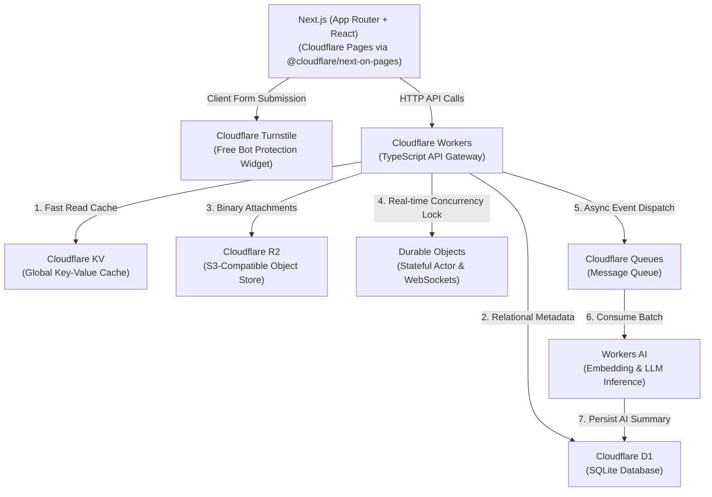

# Sequential Learning Order

- **Step 1:** [[DevOps/Cloudflare/01_Cloudflare_Core_Networking_and_Edge_Security|01 - Cloudflare Core Networking & Edge Security]]
- **Step 2:** [[DevOps/Cloudflare/02_Cloudflare_Caching_and_Edge_Performance|02 - Cloudflare Caching & Edge Performance]]
- **Step 3:** [[DevOps/Cloudflare/03_Cloudflare_Workers_Architecture_and_Primitives|03 - Cloudflare Workers Architecture & Primitives]]
- **Step 4:** [[DevOps/Cloudflare/04_Cloudflare_Developer_Platform_Master_Guide|04 - Cloudflare Developer Platform Master Guide]] *(You are here)*
- **Step 5:** [[DevOps/Cloudflare/05_Cloudflare_AI_Production_Scale_Guide|05 - Running AI Workloads on Cloudflare at Production Scale]]

---

# Cloudflare Developer Platform Fundamentals & Architecture

Cloudflare's Developer Platform provides serverless compute, storage, messaging, and AI capabilities executed globally across Cloudflare's Anycast network edge (200+ cities).

# Architecture Diagram & Full-Stack CRUD Workload Flow

The following architecture demonstrates a full-stack **AI-Powered Knowledge Base & Document Management CRUD API** built using all 8 Cloudflare developer services:



## Data Flow for CRUD Operations

- **Create (POST /items):**
  - Worker writes relational metadata (title, tags, timestamp) to **Cloudflare D1**.
  - Worker uploads the binary attachment (PDF, image, audio) to **Cloudflare R2**.
  - Worker invalidates the cached item listing in **Cloudflare KV**.
  - Worker pushes an asynchronous event to **Cloudflare Queues** for background processing.
  - Queue Consumer Worker receives the message and triggers **Workers AI** to generate a text embedding (`@cf/baai/bge-small-en-v1.5`) and summary (`@cf/meta/llama-3.1-8b-instruct`), writing the result back to D1.
- **Read (GET /items/:id):**
  - Worker checks **Cloudflare KV** for a warm cached response.
  - On KV cache miss, Worker reads metadata from **Cloudflare D1** and binary payload stream from **Cloudflare R2**, then populates KV with a 5-minute TTL.
- **Update / Real-Time Edit Lock (PUT /items/:id/lock):**
  - Worker delegates state synchronization to a **Durable Object** instance, ensuring only one client can acquire an editing lock at any given millisecond across the globe.
- **Delete (DELETE /items/:id):**
  - Worker deletes records from **D1**, removes blobs from **R2**, and purges keys from **KV**.

---

# Provisioning Cloudflare Services & Free Security with Terraform

Cloudflare infrastructure and edge security rules can be fully managed using Terraform and the official `cloudflare/cloudflare` provider (v5.x), maximizing IaC reliability and eliminating reliance on `wrangler.toml` files for production deployments.

## Terraform HCL Configuration (`main.tf`)

```hcl
terraform {
  required_version = ">= 1.5.0"
  required_providers {
    cloudflare = {
      source  = "cloudflare/cloudflare"
      version = "~> 5.0"
    }
  }
}

provider "cloudflare" {
  api_token = var.cloudflare_api_token
}

variable "account_id" {
  type        = string
  description = "Cloudflare Account ID"
}

variable "zone_id" {
  type        = string
  description = "Cloudflare Zone ID for custom domain"
}

variable "cloudflare_api_token" {
  type        = string
  sensitive   = true
  description = "Cloudflare API Token with Workers, Security & Storage permissions"
}

# ==============================================================================
# 1. FREE CLOUDFLARE SECURITY FEATURES (SSL/TLS, WAF Rulesets, Turnstile, DNSSEC)
# ==============================================================================

# A. Zone Security & Encryption Settings (Provider v5 syntax using cloudflare_zone_setting)
resource "cloudflare_zone_setting" "free_security_settings" {
  for_each = {
    ssl                      = "strict" # Enforce strict TLS validation between Cloudflare & origin
    always_use_https         = "on"     # Automatically 301 redirect all HTTP requests to HTTPS
    automatic_https_rewrites = "on"     # Automatically rewrite insecure HTTP URLs to HTTPS
    security_level           = "high"   # Challenge suspicious IPs with high threat scores
    browser_check            = "on"     # Evaluate browser headers to block malicious bots
    tls_1_3                  = "on"     # Enable modern TLS 1.3 with 0-RTT support
    opportunistic_encryption = "on"     # Allow clients to use HTTP/2 over TLS
    brotli                   = "on"     # Enable Brotli compression for static assets
    min_tls_version          = "1.2"    # Enforce minimum TLS 1.2 for modern security
  }

  zone_id    = var.zone_id
  setting_id = each.key
  value      = each.value
}

# B. Free WAF Custom Ruleset (Rate Limiting & Threat Protection)
resource "cloudflare_ruleset" "free_waf_security_rules" {
  zone_id     = var.zone_id
  name        = "Free Tier WAF and API Protection Rules"
  description = "Rate limiting and bot mitigation rules for API endpoints"
  kind        = "zone"
  phase       = "http_request_firewall_custom"

  # Rule 1: Free API Rate Limiting (Max 100 requests per minute per IP to /api/*)
  rules = [
    {
      action      = "block"
      expression  = "(http.request.uri.path starts_with \"/api/\")"
      description = "Block API abuse exceeding rate limits"
      enabled     = true

      action_parameters = {
        response = {
          content      = "{\"error\": \"Too Many Requests - Rate Limit Exceeded\"}"
          content_type = "application/json"
          status_code  = 429
        }
      }

      ratelimit = {
        characteristics     = ["ip.src"]
        period              = 60
        requests_per_period = 100
      }
    },
    # Rule 2: Block Suspicious Automated Scrapers / Vulnerability Scanners
    {
      action      = "block"
      expression  = "(http.user_agent contains \"sqlmap\" or http.user_agent contains \"nikto\" or http.user_agent contains \"python-requests\")"
      description = "Block known vulnerability scanners"
      enabled     = true
    }
  ]
}

# C. Free Cloudflare Turnstile Widget (Privacy-Friendly Bot Protection)
resource "cloudflare_turnstile_widget" "form_captcha" {
  account_id = var.account_id
  name       = "NextJS Form Turnstile Widget"
  domains    = ["example.com"]
  mode       = "managed" # Non-interactive / invisible smart CAPTCHA challenge
}

# D. Free DNSSEC Enablement (Prevent DNS Spoofing / Cache Poisoning)
resource "cloudflare_zone_dnssec" "zone_dnssec" {
  zone_id = var.zone_id
}

# ==============================================================================
# 2. DEVELOPER PLATFORM STORAGE & COMPUTE (D1, R2, KV, Queues, Workers, Pages)
# ==============================================================================

# 1. Cloudflare D1 Database
resource "cloudflare_d1_database" "crud_db" {
  account_id = var.account_id
  name       = "knowledge-base-db"
}

# 2. Cloudflare R2 Bucket
resource "cloudflare_r2_bucket" "crud_bucket" {
  account_id = var.account_id
  name       = "knowledge-base-files"
}

# 3. Cloudflare Workers KV Namespace
resource "cloudflare_workers_kv_namespace" "crud_kv" {
  account_id = var.account_id
  title      = "knowledge-base-cache"
}

# 4. Cloudflare Queue
resource "cloudflare_queue" "crud_queue" {
  account_id = var.account_id
  name       = "knowledge-base-async-queue"
}

# 5. Cloudflare Workers Script with Service Bindings (v5 syntax)
resource "cloudflare_workers_script" "crud_api_worker" {
  account_id  = var.account_id
  script_name = "knowledge-base-api"
  content     = file("${path.module}/dist/index.js")
  main_module = "index.js"

  bindings = [
    {
      name = "DB"
      type = "d1"
      d1 = {
        id = cloudflare_d1_database.crud_db.id
      }
    },
    {
      name = "BUCKET"
      type = "r2_bucket"
      r2_bucket = {
        bucket_name = cloudflare_r2_bucket.crud_bucket.name
      }
    },
    {
      name = "KV"
      type = "kv_namespace"
      kv_namespace = {
        namespace_id = cloudflare_workers_kv_namespace.crud_kv.id
      }
    },
    {
      name = "QUEUE"
      type = "queue"
      queue = {
        queue_name = cloudflare_queue.crud_queue.name
      }
    },
    {
      name = "LOCK_DO"
      type = "durable_object_namespace"
      durable_object_namespace = {
        class_name  = "DocumentLockDO"
        script_name = "knowledge-base-api"
      }
    },
    {
      name = "AI"
      type = "ai"
      ai   = {}
    }
  ]
}

# 6. Cloudflare Queue Consumer Configuration
resource "cloudflare_queue_consumer" "crud_queue_consumer" {
  account_id  = var.account_id
  queue_name  = cloudflare_queue.crud_queue.name
  script_name = cloudflare_workers_script.crud_api_worker.script_name
  batch_size  = 10
  max_retries = 3
}

# 7. Cloudflare Pages Project (Next.js App Router via @cloudflare/next-on-pages)
resource "cloudflare_pages_project" "crud_frontend" {
  account_id        = var.account_id
  name              = "knowledge-base-nextjs"
  production_branch = "main"

  build_config = {
    build_command   = "npx @cloudflare/next-on-pages@1"
    destination_dir = ".vercel/output/static"
  }

  deployment_configs = {
    production = {
      compatibility_flags = ["nodejs_compat"]
      environment_variables = {
        NEXT_PUBLIC_TURNSTILE_SITE_KEY = cloudflare_turnstile_widget.form_captcha.id
      }
    }
  }
}
```

---

# TypeScript & Next.js Implementation of Cloudflare Platform

## 1. Next.js (App Router + React) Frontend Component (`app/items/new/page.tsx`)

Demonstrates a React client component in Next.js App Router integrating Cloudflare Turnstile for bot verification before submitting data to the Worker API Gateway:

```tsx
'use client';

import { useState } from 'react';
import { Turnstile } from '@marsidev/react-turnstile';

export default function NewItemPage() {
  const [title, setTitle] = useState('');
  const [content, setContent] = useState('');
  const [file, setFile] = useState<File | null>(null);
  const [turnstileToken, setTurnstileToken] = useState<string | null>(null);
  const [status, setStatus] = useState<string>('');

  const handleSubmit = async (e: React.FormEvent) => {
    e.preventDefault();

    if (!turnstileToken) {
      setStatus('Please complete the Turnstile bot verification check.');
      return;
    }

    const formData = new FormData();
    formData.append('title', title);
    formData.append('content', content);
    formData.append('cf-turnstile-response', turnstileToken);
    if (file) formData.append('file', file);

    const res = await fetch('https://knowledge-base-api.your-subdomain.workers.dev/api/items', {
      method: 'POST',
      body: formData,
    });

    if (res.ok) {
      setStatus('Item created successfully!');
      setTitle('');
      setContent('');
    } else {
      setStatus('Failed to create item.');
    }
  };

  return (
    <div className="max-w-2xl mx-auto p-6">
      <h1 className="text-2xl font-bold mb-4">Create New Knowledge Base Item</h1>
      <form onSubmit={handleSubmit} className="space-y-4">
        <input
          type="text"
          placeholder="Title"
          value={title}
          onChange={(e) => setTitle(e.target.value)}
          required
          className="w-full border p-2 rounded"
        />
        <textarea
          placeholder="Content"
          value={content}
          onChange={(e) => setContent(e.target.value)}
          required
          className="w-full border p-2 rounded h-32"
        />
        <input
          type="file"
          onChange={(e) => setFile(e.target.files?.[0] || null)}
          className="w-full"
        />

        {/* Cloudflare Turnstile Bot Verification Widget */}
        <Turnstile
          siteKey={process.env.NEXT_PUBLIC_TURNSTILE_SITE_KEY!}
          onSuccess={(token) => setTurnstileToken(token)}
        />

        <button type="submit" className="bg-blue-600 text-white px-4 py-2 rounded">
          Submit
        </button>
      </form>
      {status && <p className="mt-4 font-semibold">{status}</p>}
    </div>
  );
}
```

## 2. Type Definitions & Environment Interface (`src/types.ts`)

```typescript
import {
  D1Database,
  R2Bucket,
  KVNamespace,
  Queue,
  Ai,
  DurableObjectNamespace,
} from '@cloudflare/workers-types';

export interface Env {
  DB: D1Database;
  BUCKET: R2Bucket;
  KV: KVNamespace;
  QUEUE: Queue<QueuePayload>;
  AI: Ai;
  LOCK_DO: DurableObjectNamespace;
}

export interface ItemRecord {
  id: string;
  title: string;
  content: string;
  file_key?: string;
  summary?: string;
  created_at: number;
}

export interface QueuePayload {
  action: 'GENERATE_AI_SUMMARY';
  itemId: string;
  content: string;
}
```

---

## 2. Durable Objects Implementation for Real-Time Concurrency (`src/lock_do.ts`)

- **Durable Objects Core Mechanics:** Durable Objects combine compute and storage into a single actor residing at a specific location globally. They provide strong consistency, single-threaded execution guarantees, and native WebSocket support.

```typescript
import { DurableObject } from 'cloudflare:workers';
import { Env } from './types';

export class DocumentLockDO extends DurableObject {
  private currentLockHolder: string | null = null;

  async fetch(request: Request): Promise<Response> {
    const url = new URL(request.url);

    if (url.pathname === '/acquire') {
      const { user } = await request.json<{ user: string }>();
      if (this.currentLockHolder && this.currentLockHolder !== user) {
        return new Response(
          JSON.stringify({ success: false, lockedBy: this.currentLockHolder }),
          { status: 409, headers: { 'Content-Type': 'application/json' } }
        );
      }

      this.currentLockHolder = user;
      await this.ctx.storage.put('lockHolder', user);
      return new Response(JSON.stringify({ success: true, lockedBy: user }), {
        headers: { 'Content-Type': 'application/json' },
      });
    }

    if (url.pathname === '/release') {
      this.currentLockHolder = null;
      await this.ctx.storage.delete('lockHolder');
      return new Response(JSON.stringify({ success: true }), {
        headers: { 'Content-Type': 'application/json' },
      });
    }

    return new Response('Not Found', { status: 404 });
  }
}
```

---

## 3. Worker API Entrypoint & CRUD Handler (`src/index.ts`)

```typescript
import { Env, ItemRecord, QueuePayload } from './types';
export { DocumentLockDO } from './lock_do';

export default {
  async fetch(request: Request, env: Env, ctx: ExecutionContext): Promise<Response> {
    const url = new URL(request.url);
    const method = request.method;

    // --- CREATE: POST /api/items ---
    if (method === 'POST' && url.pathname === '/api/items') {
      const formData = await request.formData();
      const title = formData.get('title') as string;
      const content = formData.get('content') as string;
      const file = formData.get('file') as File | null;

      const id = crypto.randomUUID();
      let fileKey: string | undefined = undefined;

      // 1. Upload file binary to R2
      if (file) {
        fileKey = `attachments/${id}-${file.name}`;
        await env.BUCKET.put(fileKey, await file.arrayBuffer(), {
          httpMetadata: { contentType: file.type },
        });
      }

      // 2. Insert metadata into Cloudflare D1 (SQLite)
      const now = Date.now();
      await env.DB.prepare(
        'INSERT INTO items (id, title, content, file_key, created_at) VALUES (?, ?, ?, ?, ?)'
      )
        .bind(id, title, content, fileKey || null, now)
        .run();

      // 3. Invalidate KV list cache
      await env.KV.delete('items_list');

      // 4. Dispatch Async AI processing job to Cloudflare Queue
      await env.QUEUE.send({
        action: 'GENERATE_AI_SUMMARY',
        itemId: id,
        content: content,
      });

      return new Response(
        JSON.stringify({ success: true, item: { id, title, content, fileKey } }),
        { status: 201, headers: { 'Content-Type': 'application/json' } }
      );
    }

    // --- READ: GET /api/items/:id ---
    if (method === 'GET' && url.pathname.startsWith('/api/items/')) {
      const id = url.pathname.split('/')[3];

      // 1. Check Cloudflare KV Cache
      const cached = await env.KV.get(`item:${id}`, 'json');
      if (cached) {
        return new Response(JSON.stringify({ source: 'KV_CACHE', data: cached }), {
          headers: { 'Content-Type': 'application/json' },
        });
      }

      // 2. Fetch metadata from Cloudflare D1
      const item = await env.DB.prepare('SELECT * FROM items WHERE id = ?')
        .bind(id)
        .first<ItemRecord>();

      if (!item) {
        return new Response('Item Not Found', { status: 404 });
      }

      // 3. Hydrate Cloudflare KV Cache with 300s TTL
      ctx.waitUntil(env.KV.put(`item:${id}`, JSON.stringify(item), { expirationTtl: 300 }));

      return new Response(JSON.stringify({ source: 'D1_DATABASE', data: item }), {
        headers: { 'Content-Type': 'application/json' },
      });
    }

    // --- LOCK COORDINATION: POST /api/items/:id/lock ---
    if (method === 'POST' && url.pathname.endsWith('/lock')) {
      const id = url.pathname.split('/')[3];
      const doId = env.LOCK_DO.idFromName(id);
      const stub = env.LOCK_DO.get(doId);
      return stub.fetch(request);
    }

    // --- DELETE: DELETE /api/items/:id ---
    if (method === 'DELETE' && url.pathname.startsWith('/api/items/')) {
      const id = url.pathname.split('/')[3];

      const item = await env.DB.prepare('SELECT file_key FROM items WHERE id = ?')
        .bind(id)
        .first<ItemRecord>();

      if (item?.file_key) {
        await env.BUCKET.delete(item.file_key);
      }

      await env.DB.prepare('DELETE FROM items WHERE id = ?').bind(id).run();
      await env.KV.delete(`item:${id}`);
      await env.KV.delete('items_list');

      return new Response(JSON.stringify({ success: true }), {
        headers: { 'Content-Type': 'application/json' },
      });
    }

    return new Response('Endpoint Not Found', { status: 404 });
  },

  // --- QUEUE CONSUMER & WORKERS AI PROCESSING ---
  async queue(batch: MessageBatch<QueuePayload>, env: Env): Promise<void> {
    for (const message of batch.messages) {
      const { itemId, content } = message.body;

      // 1. Run LLM Summarization using Workers AI (Llama 3.1 8B)
      const aiResponse = (await env.AI.run('@cf/meta/llama-3.1-8b-instruct', {
        prompt: `Summarize the following document content in 2 concise sentences: ${content}`,
      })) as { response: string };

      const summary = aiResponse.response;

      // 2. Update D1 database with generated AI summary
      await env.DB.prepare('UPDATE items SET summary = ? WHERE id = ?')
        .bind(summary, itemId)
        .run();

      // 3. Acknowledge Queue message completion
      message.ack();
    }
  },
};
```

---

# Technical Deep-Dive & Comparison Matrix of Cloudflare Services

| Service | Primary Storage Model / Purpose | Latency Profile | Consistency & Scope | When to Use vs Alternatives |
| :--- | :--- | :--- | :--- | :--- |
| **Workers** | Serverless Compute (V8 Isolates) | $<1\text{ ms}$ cold start | Stateless / Global Anycast | Replaces AWS Lambda / Express backends. |
| **D1** | Relational SQL (SQLite) | $1\text{--}5\text{ ms}$ reads | Primary Write region + Read Replicas | Structured user data, metadata, relational schemas. |
| **R2** | Object Storage (S3-Compatible) | $10\text{--}50\text{ ms}$ | Strongly Consistent / Global | Images, PDFs, media. **Zero egress fees** vs. AWS S3. |
| **KV** | Key-Value Store | $<15\text{ ms}$ global reads | Eventual Consistency (60s propagation) | Read-heavy static assets, session cache, feature flags. |
| **Queues** | Async Message Queue | Asynchronous | At-least-once delivery | Background processing, AI tasks, email notifications. |
| **Workers AI** | Edge GPU Inference | $100\text{--}500\text{ ms}$ | Serverless Edge GPU Execution | In-region embedding, text generation, image classification. |
| **Durable Objects**| Stateful Single-Instance Actor | $<5\text{ ms}$ local | Strong Consistency / Single Location | Real-time chat, collaborative document editing, lock managers. |
| **Pages** | Jamstack & Full-Stack Host | $<10\text{ ms}$ global edge | Static assets + Edge Worker Routing | Next.js (App Router + React) via `@cloudflare/next-on-pages`, React SPAs. |

---

# Verification and Deployment Workflow

- **Step 1: Compile TypeScript to JavaScript Bundle**
  ```bash
  npx esbuild src/index.ts --bundle --format=esm --outfile=dist/index.js --external:cloudflare:workers
  ```
- **Step 2: Initialize and Apply Infrastructure via Terraform**
  ```bash
  terraform init
  terraform apply -auto-approve
  ```
- **Step 3: Verify D1 Schema Initialization**
  ```bash
  npx wrangler d1 execute knowledge-base-db --command "CREATE TABLE IF NOT EXISTS items (id TEXT PRIMARY KEY, title TEXT, content TEXT, file_key TEXT, summary TEXT, created_at INTEGER);"
  ```
- **Step 4: Test End-to-End Endpoint**
  ```bash
  curl -X POST https://knowledge-base-api.your-subdomain.workers.dev/api/items \
    -F "title=Architecture Note" \
    -F "content=Cloudflare Workers use V8 isolates to deliver nanosecond cold starts across Anycast regions."
  ```
